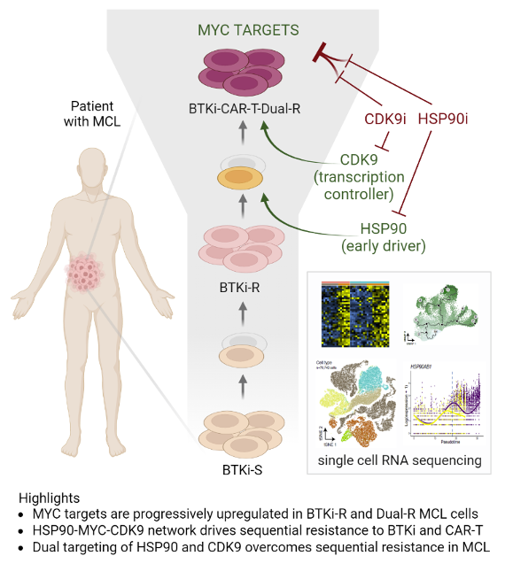

# The HSP90-MYC-CDK9 network drives therapeutic resistance in mantle cell lymphoma
**Brexucabtagene autoleucel CAR-T therapy** is highly efficacious in overcoming resistance to Bruton’s tyrosine kinase inhibitors (BTKi) in **mantle cell lymphoma**. However, many patients relapse post CAR-T therapy with dismal outcomes. To dissect the underlying mechanisms of sequential resistance to BTKi and CAR-T therapy, we performed **single-cell RNA sequencing analysis** for 66 samples from 25 patients treated with BTKi and/or CAR-T therapy and conducted in-depth bioinformatics analysis. Our analysis revealed that **HSP90-MYC-CDK9 network is the primary driving force of therapeutic resistance**. For more details, please check our [manuscript](to be added).

## Reproducibility
To reproduce the analysis and figures presented in our manuscript please see the [Reproducibility](https://github.com/lkmklsmn/b_cell_lymphoma/tree/master/Reproducibility) folder.

## Data availability
### raw dataset
Check out our raw datasets at the European Genome-Phenome Archive (EGA) database under the accession code EGAS00001005019.

## Citation
Please cite our [manuscript](to be added).

